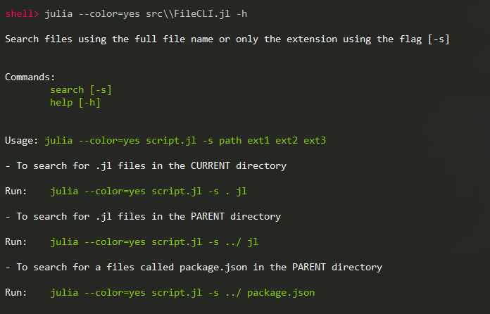
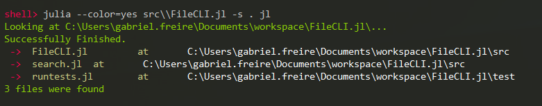

# FileCLI.jl [W.I.P.]

A *work in progress* CLI written in Julia lang for easy file search and manipulation in the terminal

# Install

```shell
sh> julia -e 'using Pkg; Pkg.add("https://github.com/gabrielfreire/FileCLI.jl")'
```

# **Usage**
### Get help


## **Search** 
### Search for .jl files in current directory

or programatically
```julia
using FileCLI

# Find all .jl files in the CURRENT folder
js_files_found = FileCLI.Search.search_by_extension(".", String["jl"])

# Find all .jl files in the PARENT folder
js_files_found = FileCLI.Search.search_by_extension("../", String["jl"])

# Find all .jl and .js files in the PARENT folder
js_files_found = FileCLI.Search.search_by_extension("../", String["jl", "js"])

# Find all .jl files in the test_folder folder
js_files_found = FileCLI.Search.search_by_extension("test_folder", String["jl"])

# Find a specific file in the test_folder folder
js_files_found = FileCLI.Search.search_by_extension("test_folder", String["test.jl"])

# Find all .json files in the PARENT folder
js_files_found = FileCLI.Search.search_by_extension("../", String["json"])
```

# Test
```shell
pkg> activate .
(FileCLI) pkg> test
```
# TODO
- Search files by name/extension [DONE]
- Image convertion i.e `png <-> jpg`
- Audio convertion i.e `wav <-> mp3`